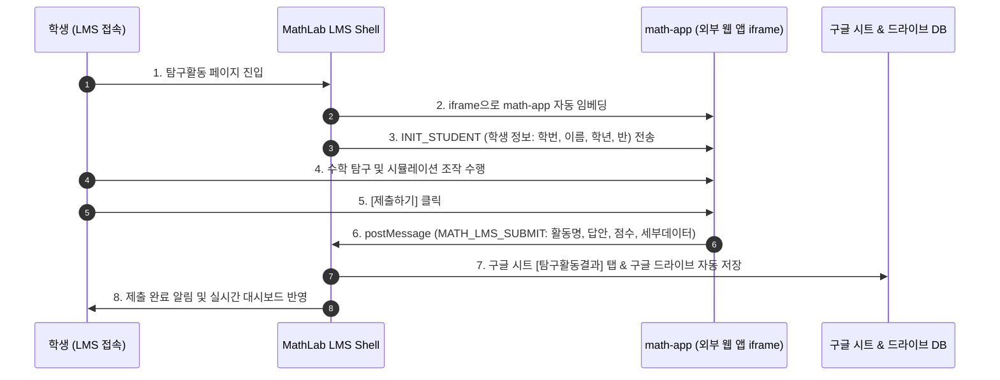

# math-app ➔ LMS 자동 임베딩 & 데이터 통합 SDK 및 연동 가이드

본 문서는 **math-app** 프로젝트에서 개발하는 모든 수학 탐구 웹 애플리케이션을 영서중학교 **MathLab 스타일 LMS (`mathlab-lms`)**에 **자동 임베딩**하고, 학생들이 실습 중 생성한 모든 산출물/답안/점수/데이터를 **LMS DB 및 구글 시트/구글 드라이브**로 자동 수집·통합하기 위한 기술 연동 규격서입니다.

---

## 1. 개요 및 동작 원리

LMS는 HTML5 `iframe` 내장 기술 및 `window.postMessage` 프로토콜 기반의 **MathLMSBridge SDK**를 통해 외부 `math-app`과 실시간 양방향 통신을 수행합니다.



---

## 2. math-app 개발 시 브릿지 연동 방법 (2가지 방법)

### 방법 A: `math-lms-bridge.js` 스크립트 포함 (추천)

`math-app` 프로젝트의 HTML 파일에 제공되는 `math-lms-bridge.js` 파일만 추가하면 자동으로 핸드셰이크 요청 및 데이터 제출 메서드가 준비됩니다.

```html
<!-- HTML head 또는 body 하단에 연동 브릿지 스크립트 추가 -->
<script src="https://mathlab-lms-9fdt.vercel.app/js/math-lms-bridge.js"></script>

<script>
  // 1. LMS 초기화 및 로그인한 학생 정보 수신
  MathLMSBridge.init({
    onStudentInfo: function(student) {
      console.log('LMS 학생 로그인 정보:', student.name, student.id, student.grade, student.classNum);
      // 예: 화면에 학생 이름을 표시하거나 개별 맞춤 탐구 상태 로드
    }
  });

  // 2. 학생이 탐구 완료 후 결과 제출 시 실행하는 함수
  function onStudentCompleteExploration() {
    MathLMSBridge.submitResult({
      activityTitle: '[math-app] 삼각비의 활용 - 건물의 높이 구하기 실습',
      answerText: 'tan(45°)=1 및 tan(30°)=0.5773을 이용하여 건물 높이 H=15.7m 유도 완료',
      score: 100,
      details: {
        angleA: 45,
        angleB: 30,
        calculatedHeight: 15.7
      }
    });
  }
</script>
```

---

### 방법 B: 순수 JavaScript `postMessage` 연동 (라이브러리 미사용 시)

별도의 라이브러리 파일 없이 순수 JS로도 100% 연동 가능합니다.

#### ① 학생 정보 요청 (Handshake)
`math-app`이 로드될 때 상위 LMS 부모 창으로 학생 정보를 요청합니다.

```javascript
window.parent.postMessage({ type: 'MATH_LMS_REQUEST_STUDENT_INFO' }, '*');

// LMS 부모 창으로부터 학생 정보 응답 수신
window.addEventListener('message', function(event) {
  if (event.data && event.data.type === 'MATH_LMS_INIT_STUDENT') {
    var student = event.data.student;
    console.log('수신된 학생 정보:', student); // { id: '20328', name: '홍길동', grade: '2', classNum: '3' }
  }
});
```

#### ② 탐구 결과 제출 및 LMS DB 자동 통합
학생이 결과를 제출할 때 아래 구조로 `postMessage`를 발송합니다.

```javascript
window.parent.postMessage({
  type: 'MATH_LMS_SUBMIT',
  activityTitle: '[탐구 단원명] 2학년 수학 이차함수 그래퍼',
  answerText: 'y = 2x^2 - 4x + 1 꼭짓점 (1, -1)',
  score: 100,
  details: { a: 2, b: -4, c: 1, vertex: [1, -1] }
}, '*');
```

---

## 3. LMS에 신규 math-app 웹 앱을 자동/수동 임베딩하는 방법

### 1) URL 파라미터를 이용한 자동 즉시 임베딩 (URL Auto-Embed)
LMS 접속 주소 뒤에 `embed_url`과 `title` 파라미터를 부여하면, 접속 즉시 해당 `math-app`이 LMS 탐구실 목록에 자동으로 임베딩 등록되어 즉시 실행됩니다.

**예시 URL**:
```text
https://mathlab-lms-9fdt.vercel.app/?embed_url=https://YOUR-MATH-APP-URL.vercel.app&title=피타고라스정리가상실습
```

### 2) 교사 대시보드에서 등록 (Manual Embed)
1. 영서중 수학 LMS (`https://mathlab-lms-9fdt.vercel.app/`) 교사 모드로 접속 (아이디: `test` / 비밀번호: `11111111`)
2. `📐 탐구 활동` 탭 클릭
3. `➕ 신규 GAS/math-app 탐구활동 주소 등록` 버튼 클릭
4. **웹 앱 URL** 주소 입력 후 등록 ➔ 실시간 목록 반영 및 학생 탐구실에 자동 공유

---

## 4. 수집된 학생 데이터 통합 저장 위치

`math-app` 웹 앱에서 전송된 자료는 다음 3곳에 동시에 자동 통합 기록됩니다:

1. **LMS 클라우드 DB**: `CloudDB.saveActivityResult()` 호출을 통해 교사 대시보드 및 `학업 이해도 분석` 탭에 즉시 반영
2. **Google Sheets (중앙 마스터 DB)**: `학교 LMS DB` 구글 시트의 **[탐구활동결과]** 탭에 실시간 행 추가
3. **Google Drive (아카이빙)**: 구글 드라이브 **[탐구보고서]** 폴더에 학생별 탐구 결과 보고서 자동 생성
